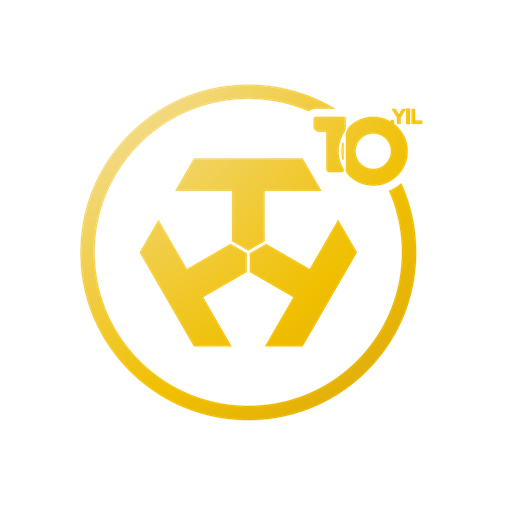
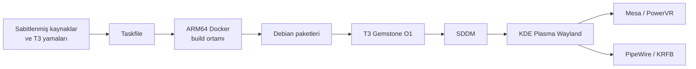

<p align="center">
  
</p>

<h1 align="center">T3 Gemstone Wayland</h1>

<p align="center">
  T3 Gemstone O1 için yeniden üretilebilir, PowerVR hızlandırmalı<br>
  KDE Plasma Wayland paketleme ve dağıtım altyapısı.
</p>

<p align="center">
  <a href="https://github.com/Emirsw/t3-gemstone-wayland/actions/workflows/ci.yml">
    
  </a>
  
  
  
  
  <a href="LICENSE">
    
  </a>
</p>

---

## Genel bakış

Bu depo, **T3 Gemstone O1 (TI AM67A, ARM64)** üzerinde çalışan masaüstü
yazılım zincirini kaynak koddan ve denetlenebilir tariflerden üretir.

Hazır `.deb` dosyaları güven kaynağı kabul edilmez. Dağıtılabilir paketler;
sabitlenmiş upstream sürümleri, açık T3 yamaları, Debian paket iskeletleri,
Docker ortamı ve GitHub Actions kullanılarak yeniden oluşturulur.

### Hedefler

- PowerVR GPU hızlandırmalı KDE Plasma Wayland oturumu
- SDDM üzerinden güvenilir ve tekrarlanabilir masaüstü açılışı
- Wayland uyumlu PipeWire/KRFB uzaktan masaüstü zinciri
- T3 Gemstone tema, sistem durumu plasmoidi ve açılış ekranı
- Tek komutlu Docker + Taskfile paket üretimi
- SHA-256, SPDX SBOM ve CI ile doğrulanabilir dağıtım

## Mimari



## Paketler

| Paket | Görevi |
|---|---|
| `t3-mesa-pvr-2405-test` | Sistem Mesa'sını değiştirmeyen izole PowerVR çalışma zamanı |
| `libkpipewire* +t3pvr1` | PowerVR uyumlu, isteğe bağlı SHM ekran yakalama |
| `krfb +t3pvr3` | Görüntü yönü, satır kopyalama ve damage tracking düzeltmeleri |
| `t3-plasma-wayland-config` | SDDM, KWin, PowerVR ve uzaktan masaüstü yapılandırması |
| `t3-gemstone-theme` | Plasma görünümü, renk şeması, ikonlar ve sistem durumu plasmoidi |
| `t3-plymouth-theme` | T3 Gemstone açılış ekranı |

## Hızlı başlangıç

### Gereksinimler

- Docker Desktop veya Docker Engine
- Docker Compose
- [Task](https://taskfile.dev/) 3.x
- Git

### Tüm paketleri oluşturma

```bash
git clone https://github.com/Emirsw/t3-gemstone-wayland.git
cd t3-gemstone-wayland

task doctor
task docker:build
task build
task verify
```

Üretilen dosyalar `dist/` dizinine yazılır.

### Tek paket oluşturma

```bash
task build:kpipewire
task build:krfb
task build:config
task build:theme
task build:plymouth
```

### Mesa paketi

Mesa paketi için onaylanmış birleşik PowerVR kaynak deposu ve sabit bir Git
referansı gerekir:

```bash
T3_MESA_SOURCE_URL=https://github.com/ORGANIZATION/mesa-pvr.git \
T3_MESA_SOURCE_REF=31d7c27a80 \
task build:mesa
```

Kaynak veya referans eksikse derleme betiği güvenli biçimde durur; binary
dosyalardan kaynak üretmeye çalışmaz.

## Depo yapısı

```text
.
├── .github/workflows/       CI ve sürüm iş akışları
├── assets/                  İkon ve masaüstü duvar kâğıtları
├── docker/                  ARM64 paket derleme ortamı
├── docs/                    Build, güvenlik ve doğrulama belgeleri
├── packages/                Kaynak kilitleri, yamalar ve paket iskeletleri
├── scripts/                 Build, kontrol, SBOM ve doğrulama araçları
├── compose.yml              Docker Compose tanımı
├── Taskfile.yml             Ana otomasyon giriş noktası
└── README.md
```

## Güvenlik ve yeniden üretilebilirlik

- Upstream sürümleri `source.lock` dosyalarında sabitlenir.
- Tüm T3 değişiklikleri incelenebilir patch dosyaları olarak tutulur.
- CI, shell sözdizimini, depo yapısını ve patch sayılarını doğrular.
- Release çıktıları SHA-256 ve SPDX JSON SBOM ile birlikte üretilebilir.
- Parolalar, özel anahtarlar, cihaz IP adresleri ve build çıktıları Git'e
  eklenmez.
- KRFB unattended access varsayılan olarak kapalıdır; kullanıcı yerel olarak
  etkinleştirip kendi parolasını belirlemelidir.

## Belgeler

| Belge | İçerik |
|---|---|
| [Build rehberi](docs/build.md) | Paket üretimi ve build değişkenleri |
| [Güvenlik modeli](docs/security.md) | Kaynak, secret ve artefakt politikası |
| [Doğrulama rehberi](docs/validation.md) | Kart üzerindeki kabul testleri |
| [Geliştirme geçmişi](docs/development-history.md) | Wayland geçişinde tamamlanan teknik çalışmalar |

## Katkı

1. Değişiklik için yeni bir dal oluşturun.
2. İlgili kaynak kilidini veya patch dosyasını güncelleyin.
3. `task doctor` ve uygun doğrulama görevlerini çalıştırın.
4. Derlenmiş `.deb`, kaynak checkout'u veya cihaz kimlik bilgisi eklemeyin.
5. Değişikliği açıklayan bir pull request açın.

## Lisans

Bu depo [Apache License 2.0](LICENSE) ile lisanslanmıştır. Upstream projeler ve
görsel marka varlıkları kendi lisans ve kullanım koşullarına tabi olabilir.
